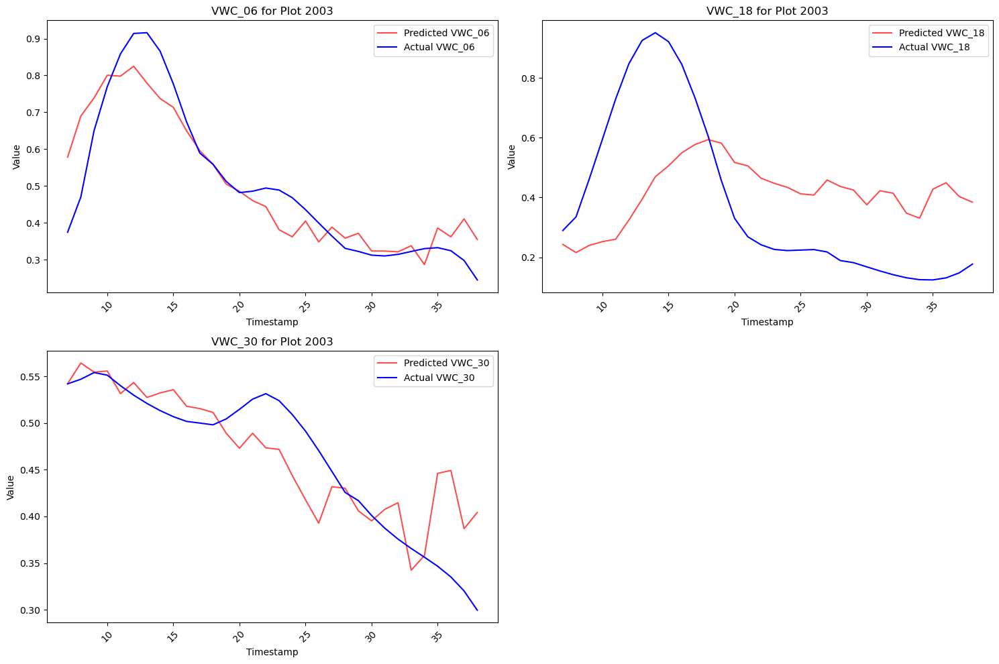
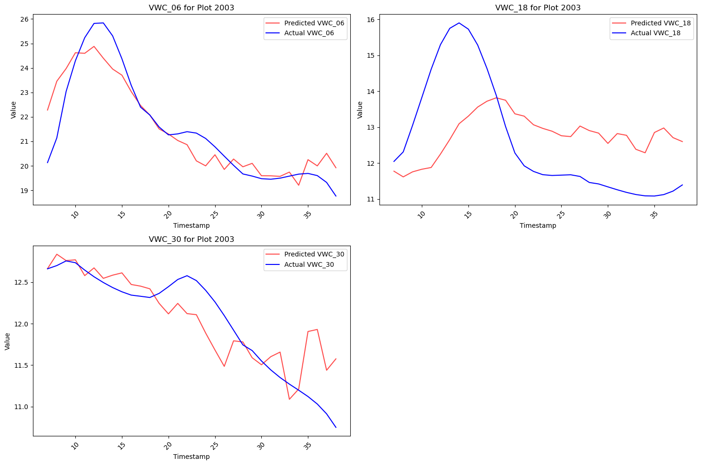
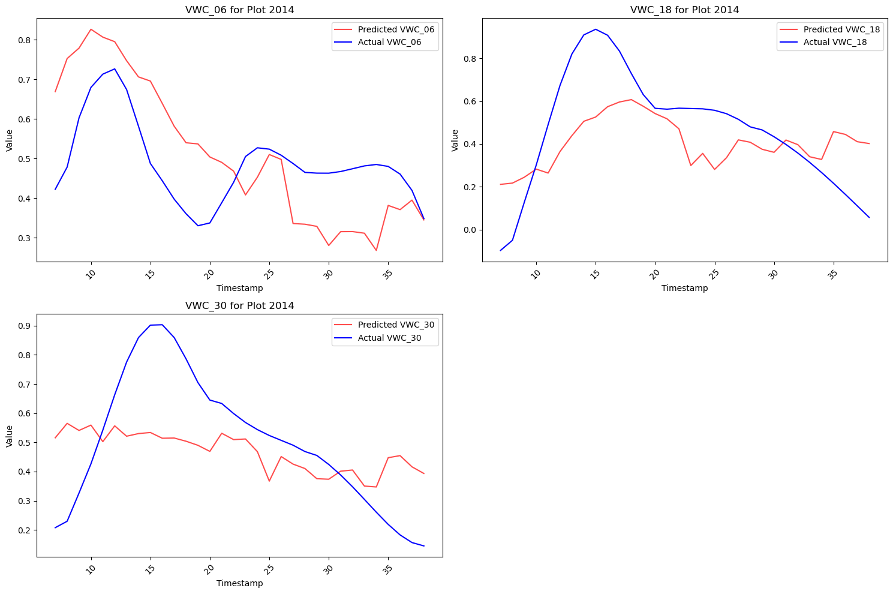
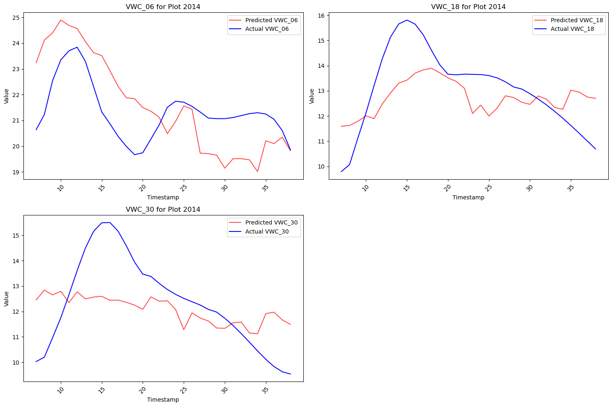
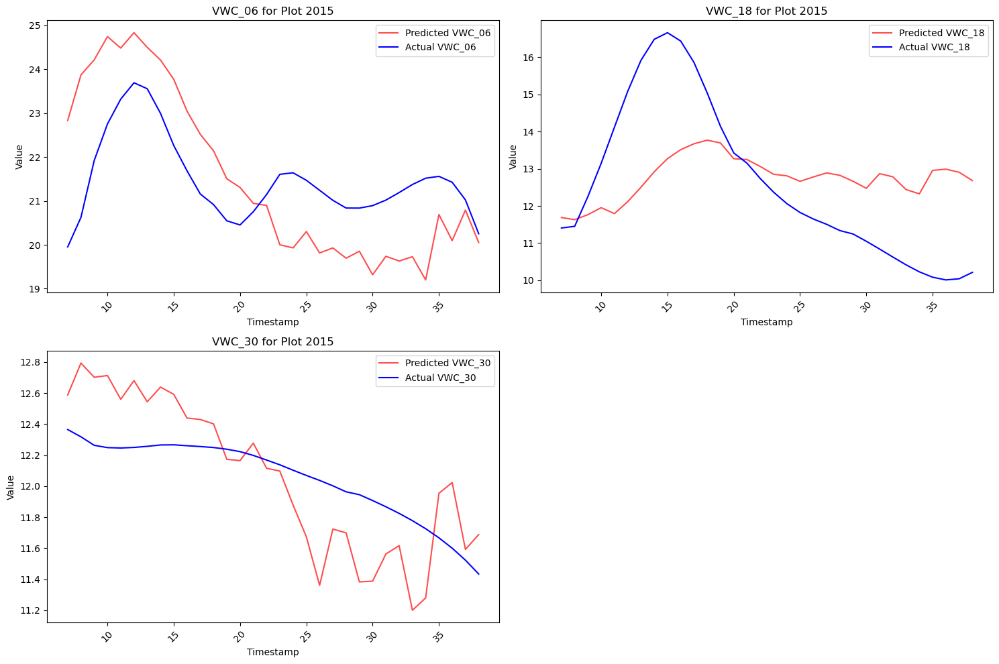
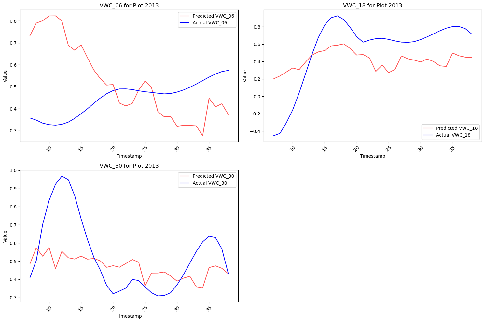
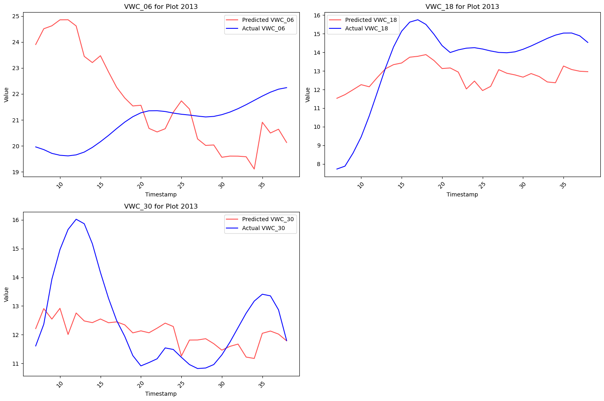
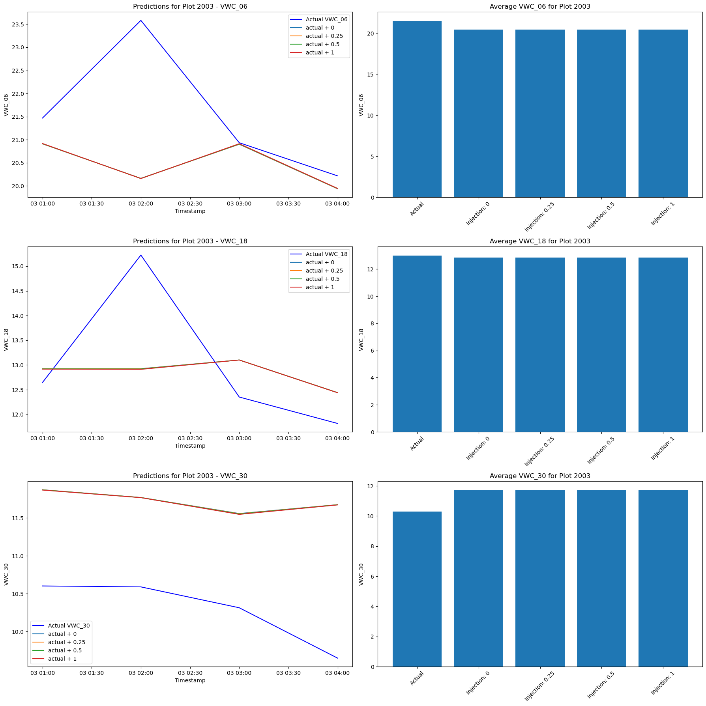

## LSTM for Predicting Volumetric Water Content (VWC)

This notebook develops an LSTM model to predict soil volumetric water content (VWC) for automated irrigation scheduling.

**Key Points:**
* Builds and evaluates LSTM model for VWC prediction
* Explores data preprocessing techniques to improve performance
* Uses time series cross-validation to assess generalizability
* Identifies challenges and suggests future strategies

**Project Contribution:**
* Provides framework for VWC prediction model
* Identifies effective data preprocessing techniques
* Highlights areas for improvement

**Applications:**
* Enhance plant stress prediction model
* Develop optimal irrigation algorithm
* Integrate with LoRaWAN IoT platform

This work is crucial for developing an efficient, sustainable automated irrigation system.

### Cell 1: Data Processing Functions

This cell defines functions for data preparation:

* **`trim_start_end_nans(df)`:** 
    * Removes rows with NaN values at the start and end of the DataFrame.
    * Iterates through each column and identifies the first and last valid indices.
    * Returns a trimmed DataFrame.

* **`process_data_for_plot(...)`:**
    * Processes data for a specific plot within a defined date range.
    * Key steps:
        * Connects to the database and loads data.
        * Filters data by plot number, date range, and relevant columns.
        * Encodes timestamps cyclically.
        * Eliminates duplicate indices and sets timestamp as index.
        * Handles missing values (trims NaNs and interpolates).
        * Smooths data in target columns using Savitzky-Golay filter.
        * Applies log transformation and creates binary column.
        * Returns processed DataFrame.

* **`transform_and_scale_data(...)`:**
    * Transforms and scales data for neural network input.
    * Key steps:
        * Copies DataFrame to avoid modifying original.
        * Subtracts mean from target columns.
        * Calculates difference-based derivatives for target columns.
        * Scales all columns using MinMaxScaler with a buffer.
        * Creates binary column.
        * Returns transformed and scaled DataFrame, updated scalers, and transformation metadata.

* **`reverse_transform_and_scale_data(...)`:**
    * Reverses transformations and scaling applied to the DataFrame.
    * Uses stored metadata to undo scaling, add back mean, and reconstruct original values from derivatives.

```python

import sqlite3
import pandas as pd
import numpy as np

from sklearn.preprocessing import MinMaxScaler
from scipy.signal import savgol_filter


def trim_start_end_nans(df):
    """
    Removes rows at the start and end of a DataFrame that have NaN values in any column.
    """
    start_idx = df.index[0]
    end_idx = df.index[-1]

    for column in df.columns:
        first_valid_index = df[column].first_valid_index()
        if first_valid_index is not None and first_valid_index > start_idx:
            start_idx = first_valid_index

        last_valid_index = df[column].last_valid_index()
        if last_valid_index is not None and last_valid_index < end_idx:
            end_idx = last_valid_index

    print(f"start_idx: {start_idx}, end_idx: {end_idx}")  # Added print statement

    return df.loc[start_idx:end_idx]

def process_data_for_plot(plot_number, target_columns, continuous_columns, start_date='2023-07-20', end_date='2023-09-03', injection_date='2023-08-03', input_window=168, forecast_horizon=96, injection_index=None, injection_amount=0):
    """
    Process data for a given plot number within a specified date range.

    Parameters:
    - plot_number: The plot number to filter the data by.
    - end_date: The end date of the period to filter the data.
    - input_window: The size of the input window for prediction.
    - forecast_horizon: The number of hours to forecast beyond the input window.

    Returns:
    - A processed DataFrame with the data for the specified plot and date range.
    """
    # Connect to the database and load data
    conn = sqlite3.connect('processed_data.db')
    query = 'SELECT * from data_table'
    df = pd.read_sql_query(query, conn)
    conn.close()

    # Filter by plot_number
    df = df[df['plot_number'] == plot_number]

    # FILTER BY COLUMNS
    df = df[['TIMESTAMP'] + target_columns + continuous_columns]
    
    # Convert 'TIMESTAMP' column to datetime format
    df['TIMESTAMP'] = pd.to_datetime(df['TIMESTAMP'])

    # # Filter by date range (for injection testing)
    # end_timestamp = pd.to_datetime(injection_date)
    # start_timestamp = end_timestamp - pd.Timedelta(hours=input_window + forecast_horizon - 1)
    # df = df[(df['TIMESTAMP'] >= start_timestamp) & (df['TIMESTAMP'] <= end_timestamp)]

    # # Filter by date range (for training)
    df = df[(df['TIMESTAMP'] >= start_date) & (df['TIMESTAMP'] <= end_date)]


    # Eliminate duplicate indices and set TIMESTAMP as index
    df = df.drop_duplicates().set_index('TIMESTAMP').sort_index()

    # Resample to daily frequency 
    df = df.resample("D").mean()


    # Interpolate missing values
    df = df[target_columns + continuous_columns].interpolate(method='pchip')

    # Spike detection for VWC columns
    for col in df.columns:
        if "VWC" in col:
            df[f"{col}_spike_up"] = (df[col] > df[col].shift(1) * 1.15).astype(int)  # 15% increase
            df[f"{col}_spike_down"] = (df[col] < df[col].shift(1) * 0.85).astype(int)  # 15% decrease

    # Time since precipitation (modify thresholds as needed)
    significant_precip_threshold = 0.2
    max_precip_value = df['precip_irrig'].max()
    
    df['time_since_last_significant_precip'] = (df['precip_irrig'] > significant_precip_threshold).astype(int)
    df['time_since_last_significant_precip'] = df['time_since_last_significant_precip'].cumsum() - df['time_since_last_significant_precip'].where(df['time_since_last_significant_precip'] == 1).ffill().fillna(0).astype(int)
    
    df['time_since_last_half_max_precip'] = (df['precip_irrig'] > (max_precip_value / 2)).astype(int)
    df['time_since_last_half_max_precip'] = df['time_since_last_half_max_precip'].cumsum() - df['time_since_last_half_max_precip'].where(df['time_since_last_half_max_precip'] == 1).ffill().fillna(0).astype(int)


    # Cumulative precipitation (replace 168 with the number of hours in the rolling window)
    df['precip_irrig_cumulative_7day'] = df['precip_irrig'].rolling(7).sum()

    # Assuming trim_start_end_nans is a predefined function to handle NaN values
    df = trim_start_end_nans(df)

    # Inject irrigation amount at the specified index
    if injection_index is not None:
        df.loc[df.index[injection_index], 'precip_irrig'] += injection_amount

    # run savgol filter with no differentiation an window = 10 to target columns
    target_columns = ['VWC_06', 'VWC_18', 'VWC_30']
    for column in target_columns:
        df[column] = savgol_filter(x=df[column], window_length=20, polyorder=4, deriv=0)

    # testing different transforms
    df['precip_irrig_log'] = np.log(df['precip_irrig'] + 1)

    return df


def subtract_mean(df, target_columns):
    mean_values = {}
    for col in target_columns:
        mean_value = df[col].mean()  
        df[col] -= mean_value
        mean_values[col] = mean_value
    return df, mean_values


def create_derivative_columns(df, target_columns, keep_original_cols=True):
    """Calculates difference-based derivatives of specified columns.

    Args:
        df: Pandas DataFrame containing the data.
        target_columns: List of columns for which derivatives are calculated.
        keep_original_cols: If True, creates new columns; otherwise overwrites.

    Returns:
        DataFrame with derivative columns, plus initial values if needed.
    """

    initial_values = {}  # Store initial values for reconstruction

    for col in target_columns:
        deriv_col_name = f"{col}_deriv"

        if keep_original_cols:
            df[deriv_col_name] = df[col].diff()  # Calculate differences
            
            #  #Plot the original and derived columns
            # plt.figure(figsize=(10, 6))
            # plt.plot(df[col], label=col)
            # plt.plot(df[deriv_col_name], label=deriv_col_name)
            # plt.xlabel('Time')
            # plt.ylabel('Value')
            # plt.title(f'{col} vs {deriv_col_name}')
            # plt.legend()
            # plt.show()
            
        else:
            initial_values[col] = df[col].iloc[0]  # Store initial value
            df[col] = df[col].diff()  
            

    return df, initial_values  # Return initial values as well

def scale_dataframe(df, scalers):
    """
    Optimally scale all columns in a DataFrame using MinMaxScaler, adjusting for an expanded range with a buffer. 
    This involves creating a dummy range for scaler fitting, then scaling the original data with the adjusted scaler.

    Args:
        df (pd.DataFrame): DataFrame with columns to be scaled.
        scalers (dict): Dictionary storing the scalers for each column.

    Returns:
        pd.DataFrame: Scaled DataFrame using the optimally adjusted scalers.
        dict: Dictionary of the adjusted scalers.
    """
    scaled_df = pd.DataFrame()  # Initialize an empty DataFrame for scaled values
    for column in df.columns:
        # Check if a scaler already exists; if not, proceed to create and fit a new one
        if column not in scalers:
            # Calculate the original range and apply a 30% buffer
            col_min, col_max = df[column].min(), df[column].max()
            range_buffer = (col_max - col_min) * 0.3  # 30% buffer
            buffered_min = col_min - range_buffer
            buffered_max = col_max + range_buffer

            # Create a new scaler and fit it on the buffered range
            scaler = MinMaxScaler(feature_range=(0, 1))
            scaler.fit([[buffered_min], [buffered_max]])
            scalers[column] = scaler

        # Scale the original data with the adjusted scaler
        scaled_values = scalers[column].transform(df[[column]].values.reshape(-1, 1)).flatten()  # Flatten the array here
        scaled_df[column] = scaled_values


    return scaled_df, scalers


def transform_and_scale_data(df, target_columns, scalers, keep_original_cols=True):
    """
    Transforms and scales the data in the DataFrame for neural network input, returning the
    transformed DataFrame, updated scalers, and transformation metadata.

    Args:
        df (pd.DataFrame): The input DataFrame.
        target_columns (list): List of target column names.
        scalers (dict): Dictionary containing MinMaxScalers for each column, can be empty.
        keep_original_cols (bool): If True, keeps original columns unchanged except for scaling;
                                   if False, applies transformations directly on the target columns.

    Returns:
        pd.DataFrame: The transformed and scaled DataFrame.
        dict: Updated dictionary containing MinMaxScalers for each column.
        dict: A dictionary containing transformation metadata for the target columns.
    """

    # Copy DataFrame to avoid modifying the original
    df_transformed = df.copy()

    
    # Subtract mean from target columns
    df_transformed, mean_values = subtract_mean(df_transformed, target_columns)
    
    # Apply transformations directly using helper functions
    df_transformed, initial_values = create_derivative_columns(df_transformed, target_columns, keep_original_cols)
    
    # Deleting or adjusting rows as necessary (e.g., due to NaN values from differentiation)
    df_transformed = df_transformed.iloc[1:]
    
    # Scale all columns in df_transformed
    df_transformed, scalers = scale_dataframe(df_transformed, scalers)
    
    #print(f"Shape of transformed DataFrame: {df_transformed.shape}")
    
    # Metadata for reverse transformation
    transformation_metadata = {
        'means': mean_values,
        'scalers': scalers,
        'keep_original_cols': keep_original_cols,
        'initial_values': initial_values
    }
    
    # add 'precip_irrig_bool' as a binned column with 0 or 1
    df_transformed['precip_irrig_bool'] = df_transformed['precip_irrig_log'].apply(lambda x: 1 if x > 0 else 0)
    
    # Metadata for reverse transformation
    transformation_metadata = {
        'means': mean_values,
        'scalers': scalers,
        'keep_original_cols': keep_original_cols,
        'initial_values': initial_values,
        'columns': df.columns.tolist()
    }
    


    return df_transformed, transformation_metadata


def reverse_transform_and_scale_data(df, transformation_metadata, target_columns):
    """
    Reverses the transformations and scaling applied to the DataFrame.

    Args:
        df (pd.DataFrame): The transformed and scaled DataFrame.
        transformation_metadata (dict): A dictionary containing transformation metadata.
        target_columns (list): List of target columns to be reverse transformed and scaled.

    Returns:
        pd.DataFrame: The DataFrame with reversed transformations and scaling.
    """

    # Extract metadata
    scalers = transformation_metadata['scalers']
    mean_values = transformation_metadata['means']
    initial_values = transformation_metadata['initial_values']
    keep_original_cols = transformation_metadata['keep_original_cols']

    # #print dimensions of df
    #print(f"Shape of input DataFrame: {df.shape}")

    # Reverse scale the target columns
    for column in target_columns:
        if column in scalers:
            # Reshape data for inverse_transform
            scaled_data = df[[column]].values
            # Apply inverse_transform
            df[column] = scalers[column].inverse_transform(scaled_data)

    # Apply undifferencing with cumsum() 
    for column in target_columns:
        # Reverse subtract mean from target columns if they were mean-adjusted
        if column in mean_values:
            #print(f"Mean for {column}: ", mean_values[column])
            df[column] = df[column] + mean_values[column]
            #print(f"Reversed mean for {column}: ", df[column].head())


    return df

```

### Cell 2: Model Building and Training Functions

This cell defines functions for model building, training, and validation:

* **`create_sequences(...)`:**
    * Creates sequences of data for training the LSTM model using a sliding window approach.
    * Takes input and target data, window size, forecast horizon, and stride as parameters.
    * Returns sequences as NumPy arrays.

* **`build_model(...)`:**
    * Builds the LSTM model architecture with LSTM layers, BatchNormalization, Dropout, and a Dense output layer.
    * Compiles the model with Adam optimizer and MSE loss function.
    * Returns the compiled model.

* **`chronological_split(...)`:**
    * Splits data chronologically into training and validation sets based on the provided test_size proportion.

* **`scheduler(...)`:**
    * Defines a learning rate scheduler that reduces the learning rate exponentially after a certain number of epochs.

* **`train_step(...)`:**
    * Defines a single training step for the model using GradientTape to calculate gradients and update weights.
    * Updates learning rate based on the scheduler.

* **`val_step(...)`:**
    * Defines a single validation step, calculating the loss on validation data without updating weights.

* **`run_workflow(...)`:**
    * Orchestrates the training and validation process:
        * Iterates through each transformed DataFrame.
        * Creates sequences for each DataFrame.
        * Splits sequences chronologically into training and validation sets using TimeSeriesSplit.
        * Builds the LSTM model.
        * Trains the model for specified epochs, performing training and validation steps for each fold.
        * Implements early stopping and saves the best model.


```python
import numpy as np
import pandas as pd
import pickle

import os
import tensorflow as tf
from tensorflow.keras.models import Sequential
from tensorflow.keras.layers import LSTM, Dense, Reshape, Dropout, BatchNormalization
from tensorflow.keras.optimizers import Adam
from tensorflow.keras.regularizers import l1, l2 
from sklearn.model_selection import TimeSeriesSplit
import matplotlib.pyplot as plt
import keras
import json


# Sequence Creation Function
def create_sequences(input_data, target_data, input_window, forecast_horizon, stride=1):
    X, y = [], []
    for start in range(len(input_data) - input_window - forecast_horizon + stride):
        end = start + input_window
        X.append(input_data[start:end])
        y.append(target_data[end:end + forecast_horizon])
    return np.array(X), np.array(y)


# def build_model(input_shape, num_targets):
#     model = Sequential([
#         LSTM(256, input_shape=input_shape, return_sequences=True, kernel_regularizer=l2(0.02)), 
#         BatchNormalization(),
#         Dropout(0.2),
#         LSTM(128, return_sequences=True),  
#         BatchNormalization(),
#         Dropout(0.2),
#         LSTM(64, return_sequences=True),  
#         BatchNormalization(),
#         Dropout(0.1),
#         LSTM(64, return_sequences=True),  
#         BatchNormalization(),
#         Dropout(0.1),
#         LSTM(32, return_sequences=False),
#         Dense(96 * num_targets), 
#         Reshape((96, num_targets)) 
#     ])
#     model.compile(optimizer='adam', loss='mse')
#     return model

def build_model(input_shape, num_targets):
    model = Sequential([
        LSTM(512, input_shape=input_shape, return_sequences=True, kernel_regularizer=l2(0.02)),
        BatchNormalization(),
        Dropout(0.2),
        LSTM(256, return_sequences=True, kernel_regularizer=l2(0.02)),  # Added regularization here
        BatchNormalization(),
        Dropout(0.2),
        LSTM(128, return_sequences=True, kernel_regularizer=l2(0.02)), 
        BatchNormalization(),
        Dropout(0.1),
        LSTM(128, return_sequences=True), 
        BatchNormalization(),
        Dropout(0.1),
        LSTM(64, return_sequences=False), 
        Dense(4 * num_targets, kernel_regularizer=l2(0.02)),  # Added regularization here
        Reshape((4, num_targets))
    ])
    model.compile(optimizer='adam', loss='mse')
    return model


def chronological_split(X, y, test_size=0.2):
    # Calculate the index to split the data
    total_samples = len(X)
    split_index = int(total_samples * (1 - test_size))
    
    # Split the data chronologically
    X_train = X[:split_index]
    X_val = X[split_index:]
    y_train = y[:split_index]
    y_val = y[split_index:]
    
    return X_train, X_val, y_train, y_val

# Learning Rate Scheduler function
def scheduler(epoch, lr):
    if epoch < 15:
        return lr
    else:
        return lr * tf.math.exp(-0.0001)


# Define the training step
@tf.function(reduce_retracing=True)
def train_step(model, optimizer, loss_function, x_batch, y_batch, epoch):
    with tf.GradientTape() as tape:
        predictions = model(x_batch, training=True)
        loss = loss_function(y_batch, predictions)
    gradients = tape.gradient(loss, model.trainable_variables)
    optimizer.apply_gradients(zip(gradients, model.trainable_variables))
    # Update the learning rate correctly using TensorFlow operations
    lr = scheduler(epoch, optimizer.learning_rate)
    optimizer.learning_rate.assign(lr)
    return loss

# Define the validation step
@tf.function(reduce_retracing=True)
def val_step(model, loss_function, x_batch, y_batch):
    predictions = model(x_batch, training=False)
    loss = loss_function(y_batch, predictions)
    return loss

def run_workflow(training_data_transformed, target_variables, input_window, forecast_horizon, stride, epochs, batch_size, patience, checkpoint_path):
    X_train_all, X_val_all, y_train_all, y_val_all = [], [], [], []
    dataframe_identifiers = []
    n_splits = 5  # Define the number of splits for cross-validation

    # Data preparation
    for i, transformed_data in enumerate(training_data_transformed()):
        df = transformed_data[0]
        X, y = create_sequences(df.values, df[target_variables].values, input_window, forecast_horizon, stride)
        tscv = TimeSeriesSplit(n_splits=n_splits)
        
        for fold, (train_index, val_index) in enumerate(tscv.split(X)):
            #print(f"Processing fold {fold+1}/{n_splits} for DataFrame_{i}")
            X_train, X_val = X[train_index], X[val_index]
            y_train, y_val = y[train_index], y[val_index]
            
            X_train_all.append(X_train)
            X_val_all.append(X_val)
            y_train_all.append(y_train)
            y_val_all.append(y_val)
        
        dataframe_identifiers.append(f"DataFrame_{i}")

    # Model and training setup
    model = build_model((input_window, X_train_all[0].shape[2]), len(target_variables))
    initial_learning_rate = 0.001 
    optimizer = tf.keras.optimizers.Adam(learning_rate=initial_learning_rate)
    loss_function = tf.keras.losses.MeanSquaredError()
    best_val_loss = np.inf

    # Training and validation
    for epoch in range(epochs):
        #print(f"Epoch {epoch+1}/{epochs}")
        epoch_val_losses = []
        
        # Update learning rate using the scheduler function
        new_lr = scheduler(epoch, optimizer.learning_rate.numpy())
        optimizer.learning_rate.assign(new_lr)
        #print(f"Current learning rate: {optimizer.learning_rate.numpy()}")

        for fold in range(n_splits):
            #print(f"Training on fold {fold + 1}/{n_splits}")
            X_train, y_train = X_train_all[fold], y_train_all[fold]

            dataset = tf.data.Dataset.from_tensor_slices((X_train, y_train)).batch(batch_size).prefetch(tf.data.AUTOTUNE)

            for x_batch, y_batch in dataset:
                train_step(model, optimizer, loss_function, x_batch, y_batch, epoch)

            # Validation
            X_val, y_val = X_val_all[fold], y_val_all[fold]
            val_dataset = tf.data.Dataset.from_tensor_slices((X_val, y_val)).batch(batch_size).prefetch(tf.data.AUTOTUNE)
            val_losses = []
            for x_batch, y_batch in val_dataset:
                val_loss = val_step(model, loss_function, x_batch, y_batch)
                val_losses.append(val_loss.numpy())

            avg_val_loss = np.mean(val_losses)
            epoch_val_losses.append(avg_val_loss)
            #print(f"Validation loss for fold {fold+1}/{n_splits}: {avg_val_loss}")

        # Average validation loss across folds
        average_val_loss = np.mean(epoch_val_losses)
        #print(f"Average validation loss for epoch {epoch+1}: {average_val_loss}")

        # Early stopping and model saving logic
        if average_val_loss < best_val_loss:
            best_val_loss = average_val_loss
            model.save(checkpoint_path)
            #print(f"Model saved at epoch {epoch+1} with validation loss: {average_val_loss}")
            wait = 0  # Reset wait counter after improvement
        else:
            wait += 1
            if wait >= patience:
                #print(f"Stopping early due to no improvement in validation loss for {patience} epochs.")
                break

    return checkpoint_path, model


```

    2024-03-21 11:21:11.540479: I tensorflow/core/util/util.cc:169] oneDNN custom operations are on. You may see slightly different numerical results due to floating-point round-off errors from different computation orders. To turn them off, set the environment variable `TF_ENABLE_ONEDNN_OPTS=0`.
    

### Cell 3: Inference and Plotting

This cell defines functions for inference and plotting predictions:

* **`plot_predictions(...)`:**
    * Plots predicted and actual values for target columns of a specific plot.

* **`predict_with_sliding_window(...)`:**
    * Performs inference on new data using a sliding window approach.
    * Predicts target variables for each sequence using the trained model.
    * Reverses transformations and scaling.
    * Plots predictions and actuals for comparison.

**Areas of Emphasis:**

* **Sliding window inference:** The model predicts on sequences created by sliding a window across the new data.
* **Reverse transformation:** Predictions are transformed back to the original scale and format for interpretation.
* **Visualization:** Predictions and actuals are plotted for visual comparison and evaluation.


```python
import numpy as np
import pandas as pd
import matplotlib.pyplot as plt
import tensorflow as tf

# run the workflow for training the model
import pickle
checkpoint_path = "./LSTM_dayhour"
# open the transformation metadata file
with open(f"{checkpoint_path}/transformation_metadata2.pkl", "rb") as file:
    transformation_metadata = pickle.load(file)


def plot_predictions(predictions_df, actuals_df, target_columns, plot_number):
    num_plots = len(target_columns)
    num_rows = int(np.ceil(num_plots / 2))  # You can adjust the number of columns per row if you like
    plt.figure(figsize=(15, 5 * num_rows))  # Adjust the figure size as needed
    for i, column in enumerate(target_columns):
        plt.subplot(num_rows, 2, i + 1)  # Adjust the number of columns per row if you like
        plt.plot(predictions_df.index, predictions_df[column], label=f'Predicted {column}', color='red', alpha=0.7)
        plt.plot(actuals_df.index, actuals_df[column], label=f'Actual {column}', color='blue')
        plt.legend()
        plt.title(f'{column} for Plot {plot_number}')
        plt.xlabel('Timestamp')
        plt.ylabel('Value')
        plt.xticks(rotation=45)
    plt.tight_layout()
    plt.show()

def predict_with_sliding_window(model, df, current_transformation_metadata, target_columns, input_window, forecast_horizon, plot_number):
    # Create input& target data, input data is all columns except target columns
    target_data = df[target_columns].values
    input_data = df.values
    predictions = []
    actuals = []
    timestamps = []
    
    # first iteration flag
    first_iter = True

    # Adjust stride based on prediction: 1 for continuous sliding
    stride = forecast_horizon
    for start in range(0, len(df) - input_window - forecast_horizon + 1, stride):
        end = start + input_window
        if end + forecast_horizon > len(input_data):
            break
        sequence = input_data[start:end]
        sequence = sequence.reshape((1, input_window, len(input_data[0])))

        

        pred = model.predict(sequence)

        
        if first_iter:
            #print(f"Sequence shape: {sequence.shape}")
            # To #print the top 3 lines, slice the second dimension (sequence length)
            #print("Sequence (top 3 lines):")
           # #print(sequence[0, :3, :])  # Access the first element of the first dimension, then slice
            #print(f"Predicted shape: {pred.shape}")
            # Similarly, for the predictions, slice the second dimension
           #print("Predicted (top 3 lines):")
            #print(pred[0, :3, :])  # Access the first element of the first dimension, then slice
        
            first_iter = False


        pred = pred.reshape(-1, pred.shape[-1])
        predictions.append(pred)
        actuals.append(target_data[end:end + forecast_horizon])
        timestamp_series = pd.Series(df.index[end:end + forecast_horizon], index=df.index[end:end + forecast_horizon])
        timestamps.append(timestamp_series)

    predictions = np.concatenate(predictions)
    actuals = np.concatenate(actuals)
    timestamps = pd.concat(timestamps)

    # Create the DataFrame with the reshaped predictions and the correct timestamps
    predictions_df = pd.DataFrame(predictions, columns=target_columns, index=timestamps)
    actuals_df = pd.DataFrame(actuals, columns=target_columns, index=timestamps)

    # Apply reverse transformation and scaling to both predictions and actuals

    # Plot the predictions and actuals before reverse transformation and scaling
    #print("Plotting predictions and actuals before reverse transformation and scaling")
    #print("Values of predictions_df  and actuals_df before reverse transformation and scaling")
    #print(predictions_df.head(3))
    #print(actuals_df.head(3))

    plot_predictions(predictions_df, actuals_df, target_columns, plot_number)

    # Apply reverse transformation and scaling to both predictions and actuals
    predictions_df = reverse_transform_and_scale_data(predictions_df, current_transformation_metadata, target_columns)
    actuals_df = reverse_transform_and_scale_data(actuals_df, current_transformation_metadata, target_columns)

    # Example usage
    #print("Values of predictions_df  and actuals_df after reverse transformation and scaling")
    #print(predictions_df.head(3))
    #print(actuals_df.head(3))
    #print("Plotting predictions and actuals after reverse transformation and scaling")
    plot_predictions(predictions_df, actuals_df, target_columns, plot_number)

    return predictions_df, actuals_df, timestamps
```

## Cell 4: Training and Inference Workflow

This cell demonstrates the complete workflow for training and evaluating an LSTM model on multiple dataframes, as well as performing inference on new data and visualizing the results. 

**1. Training:**

* **Dataframe Selection:** Specify the plot numbers for the dataframes you want to use for training. 
* **Variable Initialization:** Initialize scalers and define target columns, continuous columns, and training parameters (input window, forecast horizon, epochs, etc.).
* **Data Processing:** Use lambda functions or other methods to process and transform the dataframes consistently. 
* **Model Training:** Run the `run_workflow` function to train the model. This function should handle:
    * Data preparation
    * Model creation and training
    * Saving the best model and transformation metadata

**2. Inference:**

* **Model Loading:** Load the saved model for inference.
* **Data Preparation:** Process and transform the new data using the same methods and transformation metadata as the training data. 
* **Prediction:** Use the loaded model to make predictions on the transformed new data.
* **Reverse Transformation:** Transform the predictions back to the original scale and format using the saved transformation metadata.
* **Visualization:** Plot the predictions and actual values for comparison and evaluation. 


```python
# Example Usage
#plot_numbers = [2014, 2015, 2007, 2013]
#plot_numbers = [2013, 2014, 2015, 2007]
#plot_numbers = [2014, 2013, 2015]
plot_numbers = [2015, 2013, 2014]
plot_numbers = [2009, 2004, 2007, 2003]


# Initialize a scaler
scalers = {}

# *** Important: Update the target_columns and continuous_columns based on your chosen target columns ***
# *** Any columns included in target_columns should be removed from continuous_columns ***
target_columns = ['VWC_06', 'VWC_18', 'VWC_30']
time_columns = ['day_sin', 'day_cos', 'hour_sin', 'hour_cos', 'dow_sin', 'dow_cos']
continuous_columns = [
    'Ta_2m_Avg', 'RH_2m_Avg', 'Solar_2m_Avg', 'WndAveSpd_3m', 'Rain_1m_Tot', 'Dp_2m_Avg',
    'TaMax_2m', 'TaMin_2m', 'RHMax_2m', 'RHMin_2m', 'HeatIndex_2m_Avg',
    'irrigation', 'precip_irrig', 'canopy_temp'
]
derivative_columns = ['precip_irrig']
input_window = 7
forecast_horizon = 4
stride = 1
epochs = 2000
patience = 200
batch_size = 128
checkpoint_path = "./LSTM_dayhour"

# Set to True to keep original columns unchanged
keep_original_cols = True


def train_and_test_on_all_combinations(plot_numbers, target_columns, continuous_columns, time_columns, derivative_columns,
                                  input_window, forecast_horizon, stride, epochs, patience, batch_size, checkpoint_path,
                                  keep_original_cols):
    for i in range(len(plot_numbers)):
        train_plots = plot_numbers[:-1]
        test_plot = plot_numbers[-1]

        print(f"Training on plots {train_plots}, testing on plot {test_plot}")

           # Lambda function to handle training data and plot numbers
        training_data_dfs = lambda: [process_data_for_plot(plot, target_columns=target_columns, continuous_columns=continuous_columns) for plot in train_plots]
    
        # Store the result of training_data_dfs() in a variable
        training_dfs = training_data_dfs()
    
        # Run once to get the transformation metadata
        _, transformation_metadata = transform_and_scale_data(training_dfs[0], target_columns, scalers, keep_original_cols)

        
        # Store the transformation metadata in checkpoint_path
        with open(f"{checkpoint_path}/transformation_metadata2.pkl", "wb") as file:
            pickle.dump(transformation_metadata, file)
        
        # re-run with the transformation metadata for all training dataframes
        training_data_transformed = lambda: [transform_and_scale_data(df, target_columns, transformation_metadata['scalers'], keep_original_cols) for df in training_data_dfs()]

        # Train the model
        checkpoint_path, model = run_workflow(training_data_transformed, target_columns, 
                                      input_window, forecast_horizon, stride, epochs, batch_size, patience, checkpoint_path)

        # Prepare test data
        df_plot = process_data_for_plot(test_plot, target_columns, continuous_columns)

        # Drop VWC_42 column if it exists
        if 'VWC_42' in df_plot.columns:
            df_plot = df_plot.drop(columns=['VWC_42'])

        # Transform test data using existing transformation metadata
        df_plot, _ = transform_and_scale_data(df_plot, target_columns, transformation_metadata['scalers'], keep_original_cols)

        # Make predictions and store results
        predictions_df, actuals_df, timestamps = predict_with_sliding_window(
            model, df_plot, current_transformation_metadata=transformation_metadata,
            target_columns=target_columns, input_window=7, forecast_horizon=4, plot_number=test_plot
        )


# Run the training and testing loop
# train_and_test_on_all_combinations(plot_numbers, target_columns, continuous_columns, time_columns, derivative_columns,
#                                  input_window, forecast_horizon, stride, epochs, patience, batch_size, checkpoint_path,
#                                  keep_original_cols)
```


```python
def predict_on_plots(plot_numbers, target_columns, continuous_columns, checkpoint_path, keep_original_cols):
    # Load transformation metadata
    with open(f"{checkpoint_path}/transformation_metadata2.pkl", "rb") as file:
        transformation_metadata = pickle.load(file)

    # Load the model
    model = tf.keras.models.load_model(checkpoint_path)

    for test_plot in plot_numbers:
        print(f"Making predictions for plot {test_plot}")

        # Prepare test data
        df_plot = process_data_for_plot(test_plot, target_columns, continuous_columns)

        # Drop VWC_42 column if it exists
        if 'VWC_42' in df_plot.columns:
            df_plot = df_plot.drop(columns=['VWC_42'])

        # Transform test data using existing transformation metadata
        df_plot, _ = transform_and_scale_data(df_plot, target_columns, transformation_metadata['scalers'], keep_original_cols)

        # Make predictions and store results
        predictions_df, actuals_df, timestamps = predict_with_sliding_window(
            model, df_plot, current_transformation_metadata=transformation_metadata,
            target_columns=target_columns, input_window=7, forecast_horizon=4, plot_number=test_plot
        )


plot_numbers = [2003, 2014, 2015, 2013]

predict_on_plots(plot_numbers, target_columns, continuous_columns, checkpoint_path, keep_original_cols)
```

    2024-03-21 11:21:16.660065: I tensorflow/core/platform/cpu_feature_guard.cc:193] This TensorFlow binary is optimized with oneAPI Deep Neural Network Library (oneDNN) to use the following CPU instructions in performance-critical operations:  SSE4.1 SSE4.2 AVX AVX2 AVX512F AVX512_VNNI FMA
    To enable them in other operations, rebuild TensorFlow with the appropriate compiler flags.
    2024-03-21 11:21:17.214484: I tensorflow/core/common_runtime/gpu/gpu_device.cc:1532] Created device /job:localhost/replica:0/task:0/device:GPU:0 with 30965 MB memory:  -> device: 0, name: Tesla V100S-PCIE-32GB, pci bus id: 0000:60:00.0, compute capability: 7.0
    

    Making predictions for plot 2003
    start_idx: 2023-07-26 00:00:00, end_idx: 2023-09-03 00:00:00
    1/1 [==============================] - 2s 2s/step
    

    2024-03-21 11:21:23.812128: I tensorflow/stream_executor/cuda/cuda_dnn.cc:384] Loaded cuDNN version 8401
    Could not load symbol cublasGetSmCountTarget from libcublas.so.11. Error: /util/opt/anaconda/deployed-conda-envs/packages/tensorflow-gpu/envs/tensorflow-gpu-2.9.1-py39/lib/python3.9/site-packages/tensorflow/python/../../../../libcublas.so.11: undefined symbol: cublasGetSmCountTarget
    

    1/1 [==============================] - 0s 13ms/step
    1/1 [==============================] - 0s 12ms/step
    1/1 [==============================] - 0s 12ms/step
    1/1 [==============================] - 0s 12ms/step
    1/1 [==============================] - 0s 12ms/step
    1/1 [==============================] - 0s 12ms/step
    1/1 [==============================] - 0s 12ms/step
    


    

    


    

    


    Making predictions for plot 2014
    start_idx: 2023-07-26 00:00:00, end_idx: 2023-09-03 00:00:00
    1/1 [==============================] - 0s 13ms/step
    1/1 [==============================] - 0s 12ms/step
    1/1 [==============================] - 0s 12ms/step
    1/1 [==============================] - 0s 12ms/step
    1/1 [==============================] - 0s 12ms/step
    1/1 [==============================] - 0s 12ms/step
    1/1 [==============================] - 0s 12ms/step
    1/1 [==============================] - 0s 12ms/step
    


    

    


    

    


    Making predictions for plot 2015
    start_idx: 2023-07-26 00:00:00, end_idx: 2023-09-03 00:00:00
    1/1 [==============================] - 0s 13ms/step
    1/1 [==============================] - 0s 12ms/step
    1/1 [==============================] - 0s 12ms/step
    1/1 [==============================] - 0s 12ms/step
    1/1 [==============================] - 0s 12ms/step
    1/1 [==============================] - 0s 12ms/step
    1/1 [==============================] - 0s 12ms/step
    1/1 [==============================] - 0s 12ms/step
    


    

    


    

    


    Making predictions for plot 2013
    start_idx: 2023-07-26 00:00:00, end_idx: 2023-09-03 00:00:00
    1/1 [==============================] - 0s 13ms/step
    1/1 [==============================] - 0s 12ms/step
    1/1 [==============================] - 0s 12ms/step
    1/1 [==============================] - 0s 12ms/step
    1/1 [==============================] - 0s 12ms/step
    1/1 [==============================] - 0s 12ms/step
    1/1 [==============================] - 0s 12ms/step
    1/1 [==============================] - 0s 12ms/step
    


    

    


    

    


### Cell 5: Irrigation Injection Testing

This cell investigates whether the final trained model is responsive to injected irrigation amounts, which is crucial since the entire purpose of the model is to be sensitive to irrigation amounts. The code performs the following steps:

1. **Data Preparation:** It processes the data for the specified plot numbers using the `process_data_for_plot` function, which handles data filtering, resampling, feature engineering, and transformations.

2. **Irrigation Injection:** For each plot, the code injects different irrigation amounts (0, 0.25, 0.5, 1) at a specific index within the feasible range of the data. The injection index is determined based on the input window and forecast horizon.

3. **Predictions:** The code selects the appropriate input sequence based on the injection index, reshapes it, and makes predictions using the trained model. It then applies reverse transformations and scaling to the predictions.

4. **Visualization:** The code plots the actual values and the predicted values for each target column and each injected irrigation amount. It also creates bar charts to compare the average values of the target columns for the actual data and the different injection scenarios.

The results show that despite correct predictions on the test data, the model is not responsive to the injected irrigation amounts at the tested indices. This raises concerns about the model's sensitivity to irrigation, which is a key requirement for the project.

**Future Considerations:**
- Investigate the reasons behind the model's lack of sensitivity to irrigation amounts and explore potential solutions, such as adjusting the model architecture, input features, or training process.
- Consider alternative approaches or modifications to the model to ensure it captures the impact of irrigation on the target variables effectively.


```python
import pandas as pd
import numpy as np
import sqlite3
import tensorflow as tf
from scipy.signal import savgol_filter
import pickle
import matplotlib.pyplot as plt

def process_data_for_plot(plot_number, target_columns, continuous_columns, start_date='2023-07-20', end_date='2023-09-03', injection_date='2023-08-03', 
                          input_window=7, forecast_horizon=4, injection_amount=0):
    """
    Process data for a given plot number within a specified date range.

    Parameters:
    - plot_number: The plot number to filter the data by.
    - end_date: The end date of the period to filter the data.
    - input_window: The size of the input window for prediction.
    - forecast_horizon: The number of hours to forecast beyond the input window.

    Returns:
    - A processed DataFrame with the data for the specified plot and date range.
    """
    # Connect to the database and load data
    conn = sqlite3.connect('processed_data.db')
    query = 'SELECT * from data_table'
    df = pd.read_sql_query(query, conn)
    conn.close()

    # Filter by plot_number
    df = df[df['plot_number'] == plot_number]

    # FILTER BY COLUMNS
    df = df[['TIMESTAMP'] + target_columns + continuous_columns]
    
    # Convert 'TIMESTAMP' column to datetime format
    df['TIMESTAMP'] = pd.to_datetime(df['TIMESTAMP'])

    # run savgol filter with no differentiation an window = 10 to target columns
    target_columns = ['VWC_06', 'VWC_18', 'VWC_30']
    for column in target_columns:
        df[column] = savgol_filter(x=df[column], window_length=20, polyorder=4, deriv=0)

    # Filter by date range
    df = df[(df['TIMESTAMP'] >= start_date) & (df['TIMESTAMP'] <= end_date)]

    # Eliminate duplicate indices and set TIMESTAMP as index
    df = df.drop_duplicates().set_index('TIMESTAMP').sort_index()

    # Resample to daily frequency 
    df = df.resample("D").mean()

    # Interpolate missing values
    df = df[target_columns + continuous_columns].interpolate(method='pchip')

    # Spike detection for VWC columns
    for col in df.columns:
        if "VWC" in col:
            df[f"{col}_spike_up"] = (df[col] > df[col].shift(1) * 1.15).astype(int)  # 15% increase
            df[f"{col}_spike_down"] = (df[col] < df[col].shift(1) * 0.85).astype(int)  # 15% decrease

    # Time since precipitation (modify thresholds as needed)
    significant_precip_threshold = 0.2
    max_precip_value = df['precip_irrig'].max()
    
    df['time_since_last_significant_precip'] = (df['precip_irrig'] > significant_precip_threshold).astype(int)
    df['time_since_last_significant_precip'] = df['time_since_last_significant_precip'].cumsum() - df['time_since_last_significant_precip'].where(df['time_since_last_significant_precip'] == 1).ffill().fillna(0).astype(int)
    
    df['time_since_last_half_max_precip'] = (df['precip_irrig'] > (max_precip_value / 2)).astype(int)
    df['time_since_last_half_max_precip'] = df['time_since_last_half_max_precip'].cumsum() - df['time_since_last_half_max_precip'].where(df['time_since_last_half_max_precip'] == 1).ffill().fillna(0).astype(int)

    # Cumulative precipitation (replace 168 with the number of hours in the rolling window)
    df['precip_irrig_cumulative_7day'] = df['precip_irrig'].rolling(7).sum()

    # Assuming trim_start_end_nans is a predefined function to handle NaN values
    df = trim_start_end_nans(df)

    # testing different transforms
    df['precip_irrig_log'] = np.log(df['precip_irrig'] + 1)

    return df

def predict_on_plots(plot_numbers, target_columns, continuous_columns, checkpoint_path, keep_original_cols, injection_amounts, input_window, forecast_horizon):
    # Load transformation metadata
    with open(f"{checkpoint_path}/transformation_metadata2.pkl", "rb") as file:
        transformation_metadata = pickle.load(file)

    # Load the model
    model = tf.keras.models.load_model(checkpoint_path)

    for test_plot in plot_numbers:
        print(f"Making predictions for plot {test_plot}")

        # Make predictions for each injected irrigation amount
        predictions_dict = {}
        for amount in injection_amounts:
            # Prepare test data without injection
            df_plot = process_data_for_plot(test_plot, target_columns, continuous_columns, start_date='2023-07-20', end_date='2023-09-03', injection_date='2023-08-03', input_window=input_window, forecast_horizon=forecast_horizon, injection_amount=0)

            # Drop VWC_42 column if it exists
            if 'VWC_42' in df_plot.columns:
                df_plot = df_plot.drop(columns=['VWC_42'])

            # Transform and scale the entire dataset
            df_plot_transformed, _ = transform_and_scale_data(df_plot, target_columns, transformation_metadata['scalers'], keep_original_cols)

            # Determine the injection index
            injection_index = len(df_plot_transformed) - forecast_horizon

            #print the injection amount
            print(f"Injection amount {amount}")
            print(f"df length {amount}")
            print(f"Injection amount {amount}")
            
            # Print the value of the last index before injection
            print(f"Value before injection at index {injection_index}: {df_plot_transformed.iloc[injection_index]['precip_irrig']}")
            
            # Inject irrigation amount at the specified index
            original_value = df_plot_transformed.iloc[injection_index]['precip_irrig']
            df_plot_transformed.iloc[injection_index, df_plot_transformed.columns.get_loc('precip_irrig')] += amount
            
            # Print the value of the last index after injection
            print(f"Value after injection at index {injection_index}: {df_plot_transformed.iloc[injection_index]['precip_irrig']}")
            
            # Select the appropriate sequence based on the injection index
            start = injection_index - input_window + 1
            end = injection_index + 1
            df_plot_input = df_plot_transformed.iloc[start:end]

            # Reshape the input sequence
            input_sequence = df_plot_input.values.reshape((1, input_window, df_plot_input.shape[1]))

            # Make predictions
            predictions = model.predict(input_sequence)
            
            # Apply reverse transformation and scaling to the predictions
            predictions_df = pd.DataFrame(predictions.squeeze()[:forecast_horizon], columns=target_columns, index=pd.date_range(start=df_plot.index[-1], periods=forecast_horizon+1, freq='H')[1:])
            predictions_df_transformed = reverse_transform_and_scale_data(predictions_df, transformation_metadata, target_columns)
            predictions_dict[amount] = predictions_df_transformed

        # Plot the predictions and actuals for each target column
        num_plots = len(target_columns)
        fig, axs = plt.subplots(num_plots, 2, figsize=(18, 6 * num_plots))
        timestamps = pd.date_range(start=df_plot.index[-1], periods=forecast_horizon+1, freq='H')[1:]
        
        for i, column in enumerate(target_columns):
            ax_line = axs[i, 0] if num_plots > 1 else axs[0]
            ax_bar = axs[i, 1] if num_plots > 1 else axs[1]
            
            # Get the actual values within the forecasted window
            actual_values = df_plot[column].iloc[-forecast_horizon:]
            
            # print(f"Actual values for {column}:")
            # print(actual_values)

            ax_line.plot(timestamps, actual_values, label=f'Actual {column}', color='blue')
            for amount, predictions_df in predictions_dict.items():
                ax_line.plot(timestamps, predictions_df[column], label=f'actual + {amount}')
            ax_line.legend()
            ax_line.set_title(f'Predictions for Plot {test_plot} - {column}')
            ax_line.set_xlabel('Timestamp')
            ax_line.set_ylabel(column)

            # Bar chart for actual values and injections
            bar_data = [actual_values.mean()] + [predictions_dict[amount][column].mean() for amount in injection_amounts]
            bar_labels = ['Actual'] + [f'Injection: {amount}' for amount in injection_amounts]
            ax_bar.bar(bar_labels, bar_data)
            ax_bar.set_title(f'Average {column} for Plot {test_plot}')
            ax_bar.set_ylabel(column)
            ax_bar.tick_params(axis='x', rotation=45)

    plt.tight_layout()
    plt.show()

# Specify the plot numbers, target columns, continuous columns, and injection amounts
plot_numbers = [2003]
injection_amounts = [0, .25, .5, 1]

# Define the input window and forecast horizon
input_window = 7  # Number of days in the input sequence
forecast_horizon = 4  # Number of days to forecast


# Make predictions for each plot and injection amount
predict_on_plots(plot_numbers, target_columns, continuous_columns, checkpoint_path, keep_original_cols, injection_amounts, input_window, forecast_horizon)
```

    Making predictions for plot 2003
    start_idx: 2023-07-26 00:00:00, end_idx: 2023-09-03 00:00:00
    Injection amount 0
    df length 0
    Injection amount 0
    Value before injection at index 35: 0.18749999999999997
    Value after injection at index 35: 0.18749999999999997
    1/1 [==============================] - 1s 946ms/step
    start_idx: 2023-07-26 00:00:00, end_idx: 2023-09-03 00:00:00
    Injection amount 0.25
    df length 0.25
    Injection amount 0.25
    Value before injection at index 35: 0.18749999999999997
    Value after injection at index 35: 0.4375
    1/1 [==============================] - 0s 13ms/step
    start_idx: 2023-07-26 00:00:00, end_idx: 2023-09-03 00:00:00
    Injection amount 0.5
    df length 0.5
    Injection amount 0.5
    Value before injection at index 35: 0.18749999999999997
    Value after injection at index 35: 0.6875
    1/1 [==============================] - 0s 13ms/step
    start_idx: 2023-07-26 00:00:00, end_idx: 2023-09-03 00:00:00
    Injection amount 1
    df length 1
    Injection amount 1
    Value before injection at index 35: 0.18749999999999997
    Value after injection at index 35: 1.1875
    1/1 [==============================] - 0s 13ms/step
    


    

    


```python

```
