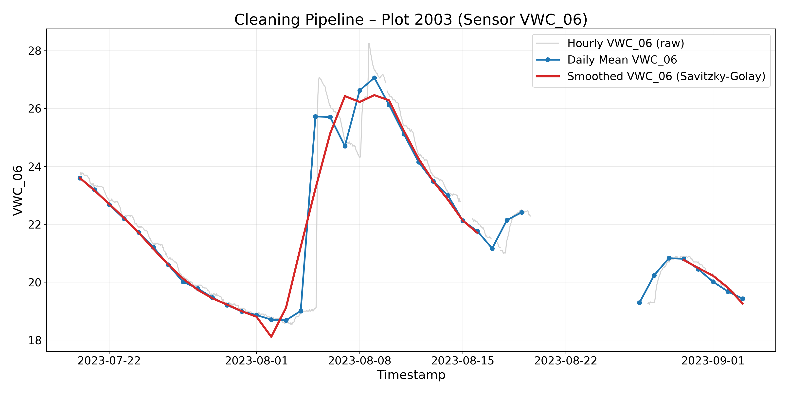
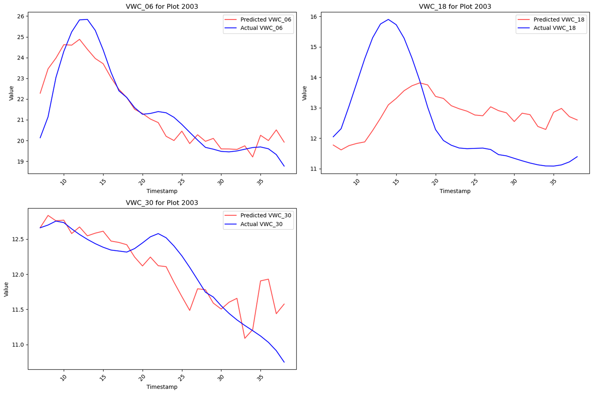
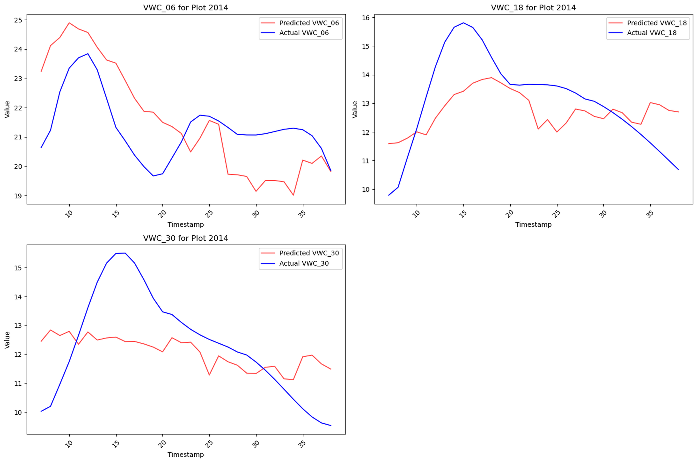
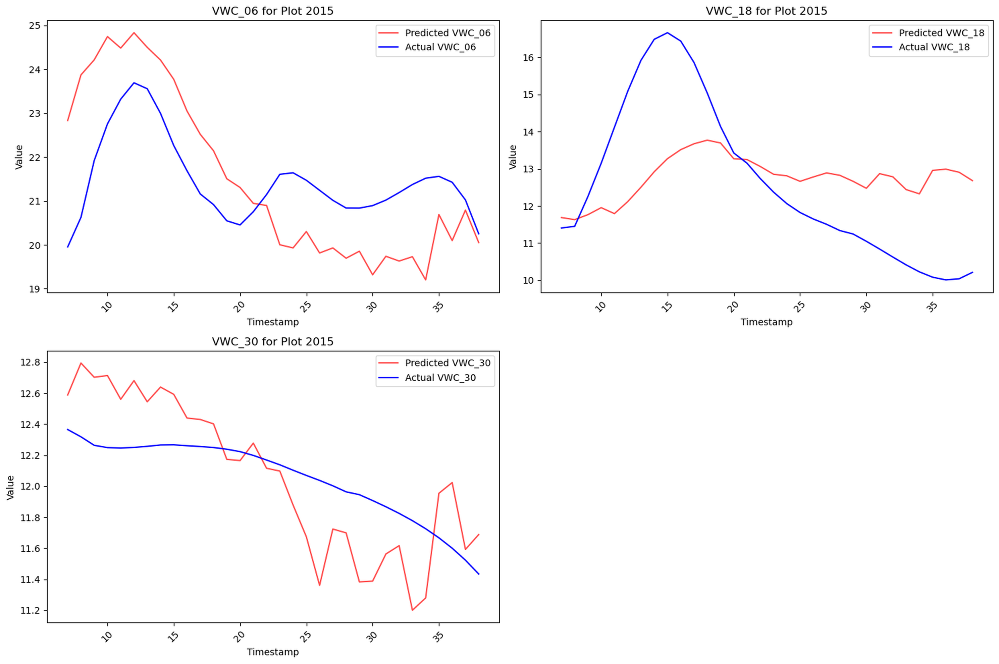
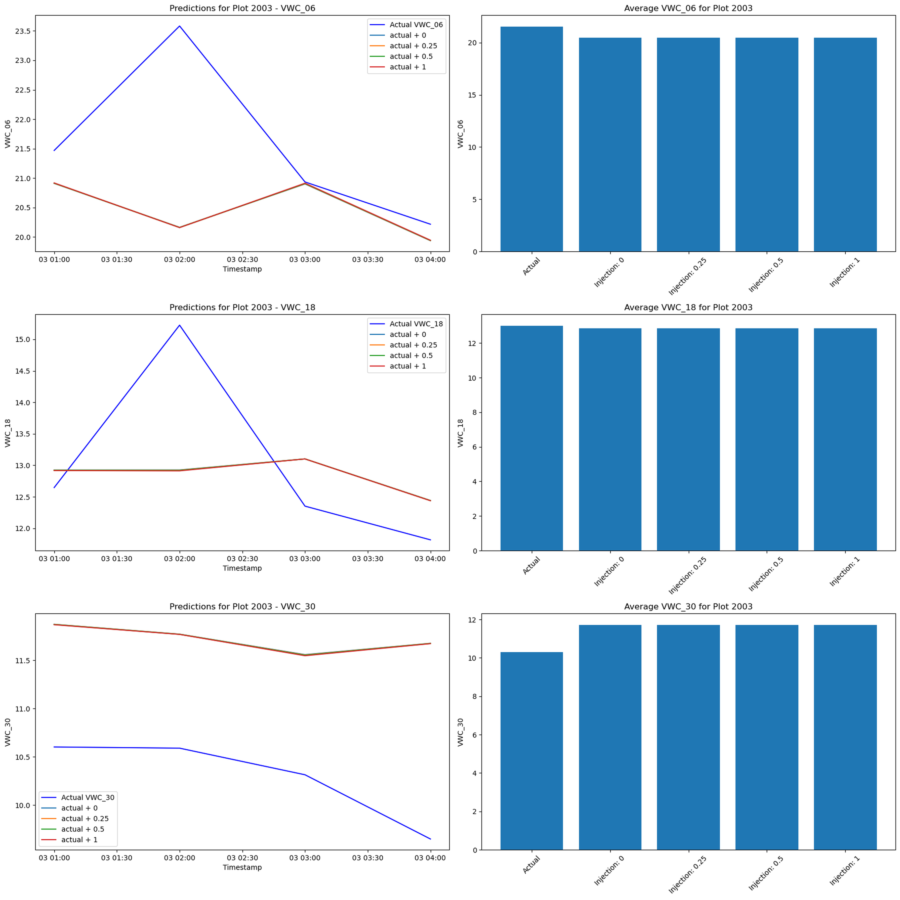

# Big Picture
- Goal: forecast volumetric water content (VWC) to automate irrigation decisions for LoRaWAN-connected plots
- Deliver 20–25 min walkthrough of messy field data → modeling → failure analysis
- Focus on single notebook `VWClstm-daily-injection.ipynb` + SQLite store `processed_data.db`
- Present every design decision, rationale, and outcome transparently

# Data Context
- Source: `data_table` in `Archive/processed_data.db` (37 704 rows, July 19 – Oct 13, 2023)
- 36 plots, hourly telemetry (weather, canopy temp, irrigation totals, four VWC depths)
- Target depths used: 6", 18", 30"; 42" discarded after quality review
- Short seasonal window ⇒ only ~11 weeks of signal per plot; must squeeze learning from dense feature stack

# Initial Audit
- Missingness: irrigation often zero; VWC sensors occasionally flatline or spike
- Duplicate timestamps resolved via `drop_duplicates()` prior to indexing
- Hourly cadence mostly consistent (≈1 080 samples per plot subset)
- Takeaway: model must tolerate sparse irrigation events and noisy soil probes

# Cleaning Pipeline
- Trim leading/trailing NaN runs with `trim_start_end_nans`
- Resample daily for visualization, but keep hourly data for modeling
- PCHIP interpolation to fill interior gaps without step artefacts
- Savitzky–Golay smoothing (window = 20) to suppress probe noise without lagging events

# Feature Engineering
- Spike flags: `VWC_*_spike_up/down` capture ±15 % day-to-day jumps
- Irrigation history: `time_since_last_significant_precip`, `time_since_last_half_max_precip`, rolling 7-day cumulative
- Log transform + binary flag for irrigation to boost rare-event visibility
- Mean-centering + first-difference derivatives for each VWC depth before scaling

# Reduced Feature Set
- After cuts: 17 continuous + 3 VWC targets + 3 VWC derivatives + irrigation flag
- Drops include: categorical crop/growth stage (sparse), VWC_42 (noisy), redundant weather extrema combinations
- Scaling via buffered MinMaxScaler preserves future headroom (±30 %)

# Training Workflow
- Sliding window: 7-day input (168 hourly steps) → 4-day horizon (96 hourly steps)
- TimeSeriesSplit (5 folds) intended for cross-plot validation, but bug feeds only first plot’s folds → limited generalization
- LSTM stack: 512→256→128→128→64 with dropout + L2; Dense reshaped to horizon × targets
- Early stopping on mean fold MSE; best weights saved in `LSTM_dayhour/`

# Model Behaviour – Plot 2003

- Captures overall decay/trend but underestimates irrigation rebounds
- Surface layer (6") best aligned; deeper probes drift shortly after forecast window starts

# Model Behaviour – Plot 2014

- Systematic positive bias on 6" depth → likely due to limited drydown examples in training folds
- 18"/30" profiles miss the sharp post-irrigation peak entirely

# Model Behaviour – Plot 2015

- Model follows trend but lags actuals by ~2 days; deeper probe diverges once soil drains
- Highlights dataset imbalance: this plot irrigated more aggressively than training plots

# Injection Experiment

- Synthetic irrigation (+0.25, +0.5, +1.0) applied just before forecast
- Desired outcome: higher predicted VWC correlating with injection size
- Observed: predictions nearly flat; averages barely change across injections

# Why Irrigation Fails
1. Injection added after scaling ⇒ engineered features (`precip_irrig_log`, flags, rolling sums) unchanged, starving the network of irrigation cues
2. Adding 0.25–1.0 to the scaled feature pushes it beyond training range (MinMax [0,1]), inducing distribution shift the LSTM never saw
3. Training bug reused folds from the first plot only, so the model never learned cross-plot irrigation variability; unseen responses default to trend continuation

# Lessons Learned
- Cleaning pipeline solid, but engineered irrigation features must update whenever interventions occur
- Fix fold selection to ensure each plot contributes to training/validation
- Re-inject irrigation prior to scaling and recompute transforms to test sensitivity honestly
- Future modelling: consider hybrid physics constraints or attention on precipitation signals

# Next Steps
- Rebuild training workflow with correct fold splitting + data augmentation on irrigation events
- Create automated figure scripts (post-analysis) to regenerate slides as data evolves
- Package notebook narrative into live demo for Q&A on transformation choices
