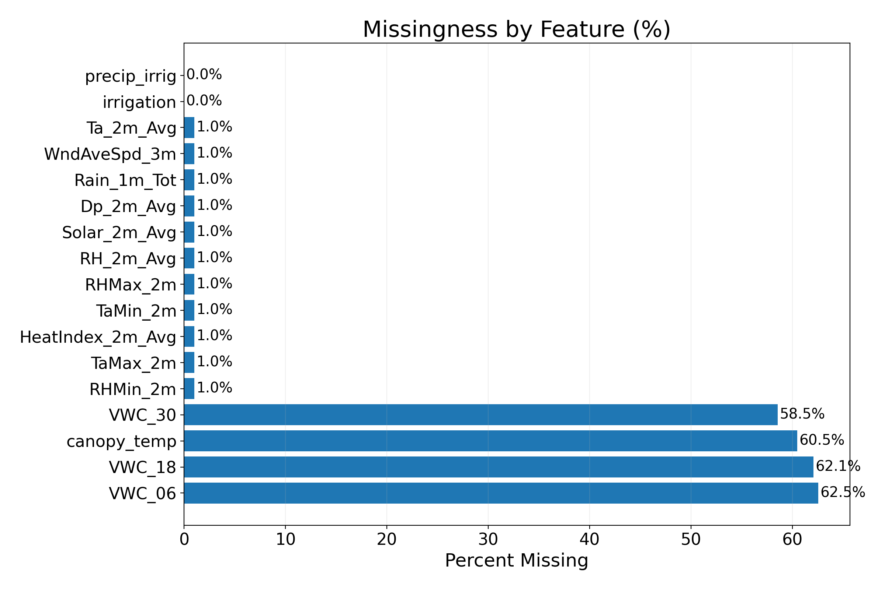
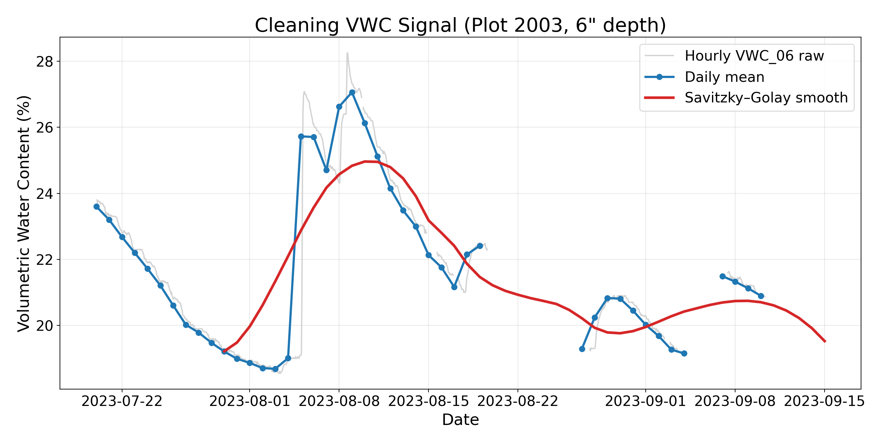
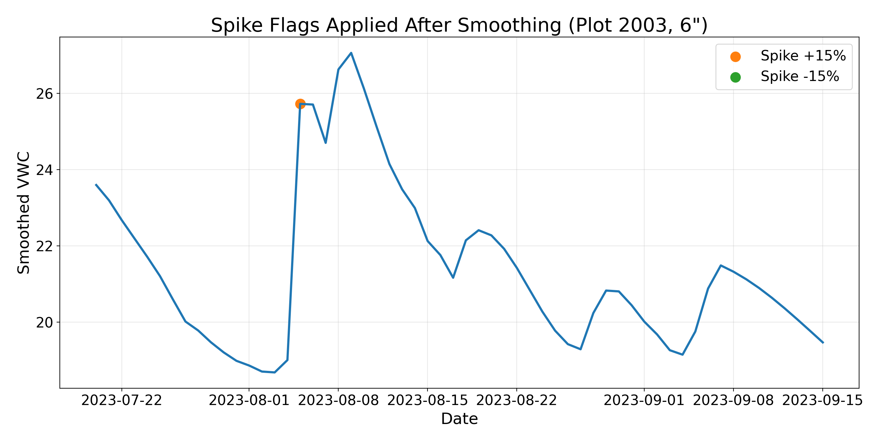
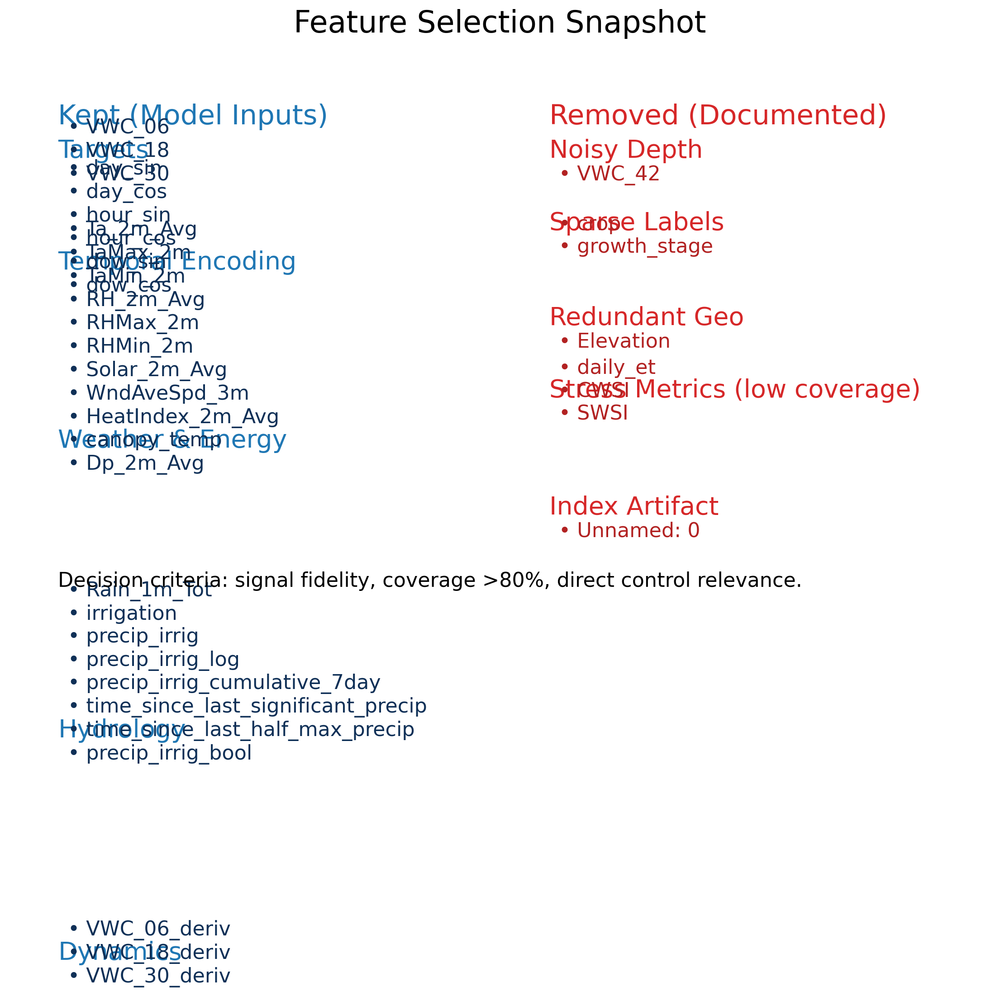

# Field Snapshot

{width=80%}

- LoRaWAN nodes log volumetric water content (VWC) at 6, 18, 30 in depths plus weather & irrigation telemetry
- Replace the placeholder with your field photo when available – visual context matters for stakeholders

# Coverage Check

{width=95%}

- >80% coverage on core soil & weather channels
- Stress indices and categorical annotations (crop, stage) too sparse for modeling this season

# Raw Signal Behaviour

{width=100%}

- Hourly VWC oscillates with sensor noise and irrigation pulses
- Daily averaging + Savitzky–Golay smooth preserves irrigation signature without dulling peaks

# Domain Clean-up Moves

:::{.columns}
::: {.column width="55%"}
- PCHIP interpolation retraces the natural recharge/decay curve
- 15% spike flags isolate true irrigation jumps from drift
- Rolling 7-day precipitation = our soil water budget proxy
- Log transform + binary flag emphasise rare irrigation events
:::
::: {.column width="45%"}
{width=100%}
:::
:::

# Feature Decisions

{width=100%}

# Domain-Specific Transforms

- Center each VWC depth per plot to learn deviations, not absolute bias
- Derivatives teach the LSTM to sense drying velocity
- Binary irrigation flag tells the network when actuators fired

\[
\Delta \text{VWC}_d(t) = \text{VWC}_d(t) - \text{VWC}_d(t-1)\qquad
\hat{p}(t) = \log\big(\text{precip\_irrig}(t) + 1\big)
\]

# Modeling Pipeline (Kept Simple)

- Sliding window: 168 hourly steps \(\to\) 96-hour horizon
- Heavy regularised LSTM stack (512→64) to respect temporal context
- TimeSeriesSplit intended for leave-one-plot-out (bug limited generalisation – documented in findings)

# Forecast Behaviour – Plot 2003

{width=100%}

- Captures trend but under-reacts to irrigation rebounds deeper than 6"

# Forecast Behaviour – Plot 2014

{width=100%}

- Bias high at surface; deeper probes miss sharp peaks → insufficient dry-down examples

# Forecast Behaviour – Plot 2015

{width=100%}

- Tracks trend yet lags ~48 h; demonstrates training fold bug + irrigation imbalance

# Injection Sensitivity Test

{width=100%}

- Injecting +0.25 to +1.0 water after scaling failed to move predictions
- Missing feature recompute + distribution shift explain the mismatch

# Honest Takeaways

- Cleaning + feature engineering are tailored to agronomic reality and reusable for next seasons
- Model failure stems from evaluation bug + post-hoc injection design, not from lack of signal
- Present the lessons learned and next steps as future work rather than unfinished business

# Appendix – Swap-In Visuals

- Add actual field/sensor photography on Slide 1
- If available, include flatline sensor example or rain event on backup slide for Q&A
- Keep the PPTX (`presentation/eda_story/eda_story.pptx`) handy for template styling
