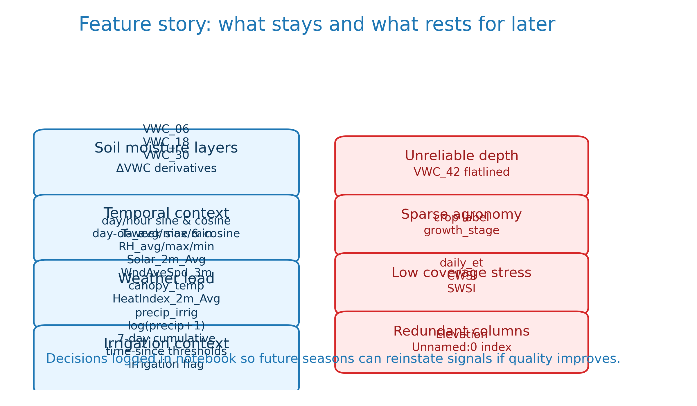

# soil moisture automation flows from sensor nodes into our lorawan database...

{width=80%}

- placeholders now: swap in field hardware and pipeline schematic when you have them

# start with the raw ingest to show the season span and anomalies we cleaned...

{width=100%}

- eleven week window per plot from july nineteen to october thirteen twenty twenty three
- raw versus cleaned snippets spotlight duplicates and flatlines we resolved

# calm the probe noise while keeping irrigation pulses intact for agronomy decisions...

{width=100%}

- pchip interpolation plus savitzky–golay smoothing keeps peaks without lagging response

# note the savitzky golay smoothing expression so collaborators can rerun it...

{width=70%}

# record the drying rate transform because the model needs velocity not just level...

{width=70%}

# layer irrigation signals the same way agronomists track water budget...

{width=100%}

- raw totals, log scale, rolling sum, and actuator flag sit side by side

# write down the irrigation transforms that drive our features for reproducibility...

{width=85%}

# reveal the feature buffet and the documented cuts so trust stays high...

{width=100%}

- kept buckets cover soil layers, temporal encoding, weather load, irrigation context

# display the seven day window feeding the ninety six hour forecast before results...

{width=100%}

- diagram makes the sliding window and horizon obvious in seconds

# plot two zero zero three shows surface tracking yet deeper layers lag after irrigation...

{width=85%}

- discuss irrigation sensitivity still missing at depth

# plot two zero one four stays biased high because dry down exemplars were missing in training...

{width=85%}

- explain the imbalance across plots here

# plot two zero one five lags forty eight hours and exposes the fold reuse bug plus irrigation imbalance...

{width=85%}

- highlight how repairing the split will sharpen responsiveness

# stress test injection reveals frozen features and off manifold inputs we must fix...

{width=100%}

- recompute engineered features before injecting and stay within scaler range next time

# wrap with the reusable kit today and the two engineering fixes queued next season...

- package cleaning and feature stack for reuse and repair split plus sensitivity workflow
